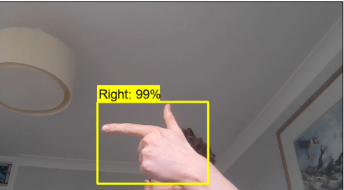

# Realtime Object Detection app
Simple app using webcam for real time object detection. Uses Tensorflow Object Detection API, React and Tensorflow JS.

Detects "Up", "Down", "Left", "Right" from hand gestures

## Tuning 

Model needs tuning, left gesture has poor performance compared to others

Precision suffers when swapping/using different hands 

##

## 

Credit to Nicholas Renotte
